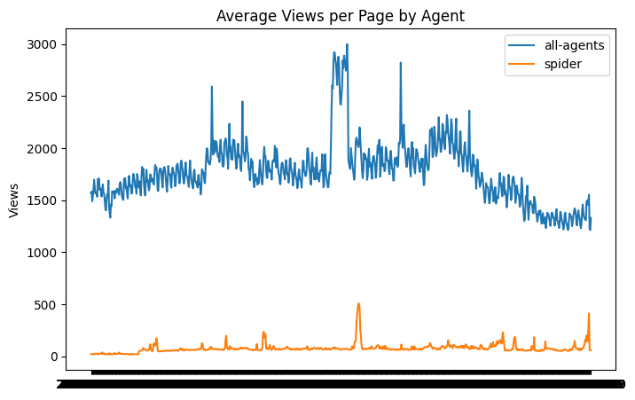
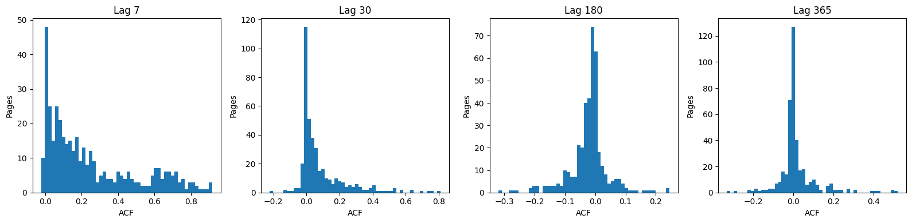
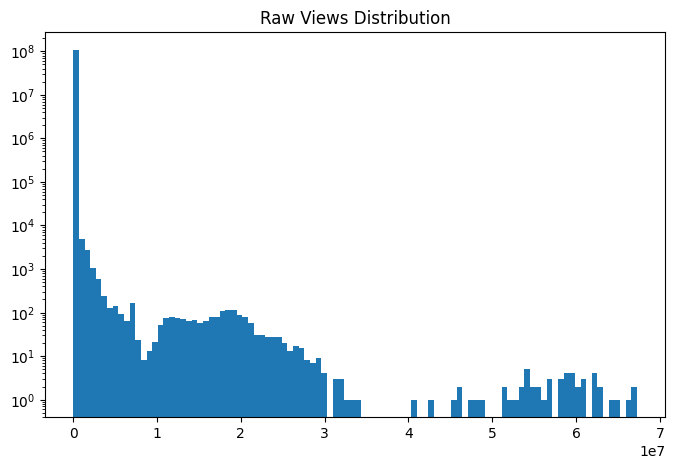

# Web Traffic Time-Series Forecasting

A PyTorch solution for the [Kaggle Web Traffic Time-Series Forecasting](https://www.kaggle.com/competitions/web-traffic-time-series-forecasting) competition.

**Final submission:** ensemble of 16 GRU+ConvAttention models — **SMAPE: 38.50046**

---

## Competition Overview

The task is to forecast daily page views for ~145,000 Wikipedia articles. Each time series spans from July 1, 2015 to December 31, 2016 (training), with predictions required for 62 future days. The evaluation metric is **SMAPE** (Symmetric Mean Absolute Percentage Error), defined as 0 when both predicted and actual values are 0.

Each page name encodes metadata in the format `<article>_<lang>.wikipedia.org_<access>_<agent>`, enabling extraction of language, access type, and agent type as categorical features.

---

## Project Structure

```
WTTSF-competition/
├── configs/                  # YAML experiment configs
├── data/
│   └── processed/            # Preprocessed .npy / .npz files
├── dataset/
│   ├── dataset.py            # WTTSF_Dataset (PyTorch)
│   └── dataset_factory.py
├── losses/                   # MAE, SMAPE, Huber
├── models/
│   ├── attention/            # Additive, Dot, MultiHead, ConvAttention
│   ├── lstm_baseline.py      # Seq2seq LSTM with optional attention
│   ├── gru_conv_attn.py      # GRU + ConvAttention (final model)
│   └── lstm_conv_attn.py     # LSTM + ConvAttention
├── optimizers/
├── schedulers/
├── utils/
│   ├── config_cls.py         # Config dataclass
│   ├── constants.py          # Feature dims, lag days, regex
│   └── helpers.py
├── prepare_data.py           # Full preprocessing pipeline
├── train.py                  # Training loop
├── make_prediction.py        # Inference & submission builder
└── plots/                    # EDA images
```

---

## Exploratory Data Analysis

### Global Traffic


Mean traffic rises through mid-2016, spikes sharply (likely a major event or data anomaly), then falls toward the end of the series. There is a clear weekly seasonality visible as high-frequency oscillation.

### Traffic by Access and Agent




Desktop traffic dominates. Spider (bot) traffic is very low on average but has sharp spikes. All-access and desktop track closely, which makes sense as all-access aggregates all types.

### Traffic by Language


English Wikipedia articles receive far more views than any other language — roughly 3–5× the next largest languages. Russian (`ru`) has one large anomalous spike.

### Frequency Analysis


FFT of the median series confirms strong weekly (7-day) periodicity. Monthly and half-year peaks are also present but weaker. This motivated encoding day-of-week and month-of-year as sine/cosine features.

### Autocorrelation




The global ACF decays slowly but stays strongly positive out to lag 30, confirming persistent short-term autocorrelation. Per-page lag distributions (7, 30, 180, 365 days) are tight around zero for longer lags — most pages have weak long-range seasonal autocorrelation, but the subset with strong yearly patterns justifies including year/quarter autocorrelation as page-level features.

### Views Distribution




Raw views follow a heavy-tailed distribution (log scale). After `log1p` transform the distribution is approximately bell-shaped, validating the use of log-space for modeling.

### Page Volatility


A bimodal distribution: one cluster of low-volatility pages (stable content) and one of high-volatility pages (news, events). The model must handle both regimes.

---

## Data Preprocessing

Run once before training:

```bash
python prepare_data.py --config configs/your_config.yaml
```

Outputs are saved to `data/processed/`. Key config parameters (defaults shown):

| Parameter | Default | Description |
|---|---|---|
| `lookback` | 365 | Encoder window length (days) |
| `horizon` | 62 | Prediction window (days) |
| `add_days` | 63 | Extra days appended for lag index coverage |
| `first_date` | `2015-07-01` | Date of column index 0 in the CSV |
| `dead_check_window` | 365 | Drop pages with no traffic in last N days |
| `max_gap_interpolate` | 7 | Linearly interpolate NaN gaps ≤ N days |
| `winsor_k` | `null` | Spike cap: median ± `winsor_k` × MAD (disabled by default) |
| `max_zero_ratio` | 0.3 | Exclude pages where fraction of zeros > threshold (dataset-level) |

### Preprocessing Steps

1. **Drop dead pages** — remove pages with all-zero/NaN traffic or no activity in the last `dead_check_window` days.
2. **Winsorization** (optional) — per-series spike capping using median ± k·MAD.
3. **Gap interpolation** — linear interpolation for short NaN runs (≤ `max_gap_interpolate` days); longer gaps are zero-filled.
4. **Log1p transform** — applied globally before saving.
5. **Lag indices** — precomputed source-day indices for lags [90, 180, 270, 365] days.
6. **Temporal features** — sin/cos encodings of day-of-week and month-of-year for every day in `n_days_full`.
7. **Page-level features** — one-hot encodings of language, access type, agent, site (all z-score normalized); plus page mean, std, coefficient of variation, and smoothed year/quarter autocorrelation.

---

## Features

Each encoder timestep receives `ENC_DIM` features; the decoder receives `DEC_DIM = ENC_DIM - 1` (no raw hits in decoder input):

| Group | Size | Description |
|---|---|---|
| Hits | 1 | Log1p page views, z-score normalized per series |
| Lag values | 4 | Lagged hits at 90/180/270/365 days |
| Lag validity mask | 4 | Binary mask (1 = lag is in range) |
| Temporal | 4 | sin/cos of day-of-week and month-of-year |
| Page autocorr | 2 | Year and quarter autocorrelation |
| Page stats | 3 | Per-page mean, std, coefficient of variation |
| Page categories | 17 | One-hot: lang (8), access (3), agent (2), site (4) — all z-normalized |

---

## Model Architectures

All models follow a **seq2seq** design: an RNN encoder reads the lookback window, and a step-by-step RNN decoder generates `horizon` predictions autoregressively.

### Baseline LSTM (`lstm_baseline.py`)

Standard seq2seq LSTM with optional attention on encoder states. Supports `none`, `additive` (Bahdanau), `dot` (scaled dot-product), and `multihead` attention.

```
Encoder (LSTM, n_layers) → [enc_states, h_n, c_n]
Attention (query=h_dec, keys=enc_states) → context
Decoder (LSTMCell × n_layers): [prev_pred | dec_in | context] → pred_t
```

### LSTM + ConvAttention (`lstm_conv_attn.py`)

Replaces standard attention with `ConvAttention` (see below).

### GRU + ConvAttention (`gru_conv_attn.py`) — Final Model

Same structure but uses GRU instead of LSTM. GRU is easier to regularize (no cell state), trains faster, and proved more stable.

### ConvAttention (`conv_attention.py`)

Inspired by the 1st-place solution. Instead of query-key attention over encoder states at each decoder step, a `ConvFingerprint` CNN produces a compact signature of the input series, which is used to compute attention weights over an attention window via a learned linear projection. These weights are applied as a depthwise convolution over encoder readouts, producing a fixed attention context for all `horizon` steps at once.

```
enc_input[:, :, :FINGERPRINT_SIGNAL] → ConvFingerprint (CNN) → fingerprint [B, fingerprint_size]
fingerprint → Linear → scores [B, attn_window, n_heads] → normalize
enc_states → Linear → readout [B, lookback, readout_size]
depthwise conv(readout, scores) per head → [B, horizon, readout_size]
concat heads → [B, horizon, readout_size * n_heads]
```

This is more efficient than per-step attention (one forward pass produces the full horizon context) and captures global series shape rather than local alignment.

---

## Training

```bash
python train.py --config configs/gru_conv_attn_smape.yaml --tag gru_conv_attn_smape_1

# With validation split
python train.py --config configs/gru_conv_attn_smape.yaml --use-valid --tag experiment
```

### Training Loop Design

**Step-based (not epoch-based).** The dataset is large and epoch-level checkpointing caused slow feedback loops. Training runs for `steps` gradient updates, with evaluation/checkpointing every `update_steps` steps. This also gave fine-grained control over early stopping and EMA warmup.

**Denormalized loss.** The model predicts in normalized (z-score) space but loss is computed after denormalizing both predictions and targets back to log1p space. This made SMAPE significantly more stable and better calibrated compared to computing it in normalized space.

**Exponential Moving Average (EMA).** Applied to model weights with `ema_decay=0.999`. EMA weights are used for both validation and inference, substantially reducing variance across runs.

**Checkpointing.** Best checkpoint (lowest validation loss) is saved. Warmup phase (`warmup_steps`) suppresses saving until the model has converged past its initial instability.

---

## Regularization

RNNs on time series overfit aggressively. Multiple regularization mechanisms were combined:

**Dropout (all applied independently):**

| Parameter | Location |
|---|---|
| `dropout_enc` | Between encoder LSTM layers |
| `dropout_dec` | Between decoder RNN layers |
| `dropout_ctx` | On encoder hidden state passed to decoder init |
| `dropout_h` | On decoder hidden state at each step |
| `dropout_c` | On decoder cell state (LSTM only) |
| `dropout_out` | Before output projection |
| `readout_dropout` | Before readout projection in ConvAttention |
| `fingerprint_dropout` | Before FC layers in ConvFingerprint |

**State regularization penalties** (added to loss):

- `temporal_smoothness_penalty` (TSP) — penalizes `||h_t - h_{t-1}||²`, encouraging smooth hidden state trajectories.
- `state_energy_penalty` (SEP) — penalizes `||h||²`, discouraging large activations.

Both are applied to decoder hidden (and cell) states with configurable weights `tsp_h`, `sep_h`, `tsp_c`, `sep_c`.

The final config uses very strong regularization: `dropout_ctx=0.52`, `readout_dropout=0.48`, `fingerprint_dropout=0.18`, `tsp_h=sep_h=3e-6`.

---

## Experiment History & Key Decisions

### Loss Function

Initial experiments compared MAE, Huber, and smoothed SMAPE across identical baseline LSTM configs:
- **MAE** — solid baseline.
- **Huber** — similar to MAE at small `delta`; degraded as `delta` increased.
- **Smoothed SMAPE** — occasionally worse than MAE early on, but more stable and better on the public leaderboard. After switching to denormalized loss computation it consistently outperformed the others and became the final choice.

### Attention Mechanisms

Tested on the baseline LSTM: `multihead ≈ additive > dot`. Additive attention was chosen as the default for its efficiency. ConvAttention then outperformed or matched additive attention while being faster (no per-step computation).

### 2-Layer RNN

A 2-layer stacked RNN was tested and failed — significantly worse validation loss and unstable training. Stayed with `n_layers=1` throughout.

### LSTM → GRU

After ConvAttention was stable, switched from LSTM to GRU. GRU has no cell state, halving the number of state-related dropout/regularization parameters, and proved easier to tune. Validation quality was equivalent or better.

### Validation Strategy

An early `--use-valid` split was used to diagnose overfitting and compare loss functions. Later experiments were evaluated directly via Kaggle submissions to avoid overfitting the validation split. The final config does not use a held-out validation set — all data goes to training.

### Ensemble

Final submission: **16 models** — 4 random seeds × 4 checkpoint steps (1100/1200/1300/1400). Predictions are averaged with equal weights. This reduced variance substantially compared to any single model.

---

## Final Configuration

`configs/gru_conv_attn_smape.yaml`:

```yaml
lookback: 365
horizon: 62

train_batch: 128
n_workers: 4

seed: 6769
steps: 1400
warmup_steps: 1100
update_steps: 100
max_norm: 5
ema_decay: 0.999

tsp_h: 0.000003
sep_h: 0.000003

model:
  name: "GRU_ConvAttn"
  parameters:
    enc_h_size: 256
    dec_h_size: 256
    n_layers: 1
    readout_size: 64
    fingerprint_size: 16
    attn_n_heads: 2
    dropout_ctx: 0.52
    dropout_h: 0.015
    dropout_out: 0.15
    readout_dropout: 0.48
    fingerprint_dropout: 0.18

loss:
  name: "SMAPE"

optimizer:
  name: "AdamW"
  parameters:
    lr: 0.0003
    betas: [0.9, 0.999]
    weight_decay: 0.001

scheduler:
  name: "CosineAnnealingLR"
  parameters:
    T_max: 14
    eta_min: 0.0001
```

---

## Reproducing the Final Submission

### 1. Preprocess

```bash
python prepare_data.py --config configs/gru_conv_attn_smape.yaml
```

### 2. Train (4 seeds)

```bash
for SEED in 1 2 3 4; do
  python train.py \
    --config configs/gru_conv_attn_smape.yaml \
    --tag gru_conv_attn_smape_${SEED}
done
```

Each seed produces checkpoints at steps 1100, 1200, 1300, 1400 (saved when validation loss improves or at the final step).

### 3. Predict & Ensemble

```bash
python make_prediction.py \
  --configs configs/gru_conv_attn_smape.yaml \
  --checkpoints \
    checkpoints/gru_conv_attn_smape_1_s1100_checkpoint.pt \
    checkpoints/gru_conv_attn_smape_1_s1200_checkpoint.pt \
    checkpoints/gru_conv_attn_smape_1_s1300_checkpoint.pt \
    checkpoints/gru_conv_attn_smape_1_s1400_checkpoint.pt \
    checkpoints/gru_conv_attn_smape_2_s1100_checkpoint.pt \
    ... (all 16 checkpoints) \
  --key data/key_2.csv \
  --out submissions/submission.csv
```

---

## Results

| Submission | SMAPE |
|---|---|
| GRU + ConvAttention + SMAPE, ensemble (4 seeds × 4 steps) | **38.50046** |

---

## References

- [1st place solution by Arturus](https://www.kaggle.com/competitions/web-traffic-time-series-forecasting/discussion/43795) — core inspiration for the ConvAttention / fingerprint approach and smoothed SMAPE loss.
- [Web Traffic Time-Series Forecasting — Kaggle competition](https://www.kaggle.com/competitions/web-traffic-time-series-forecasting)