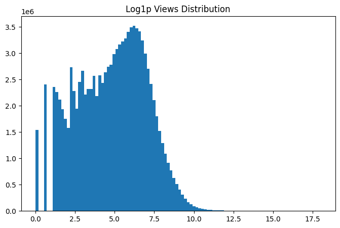
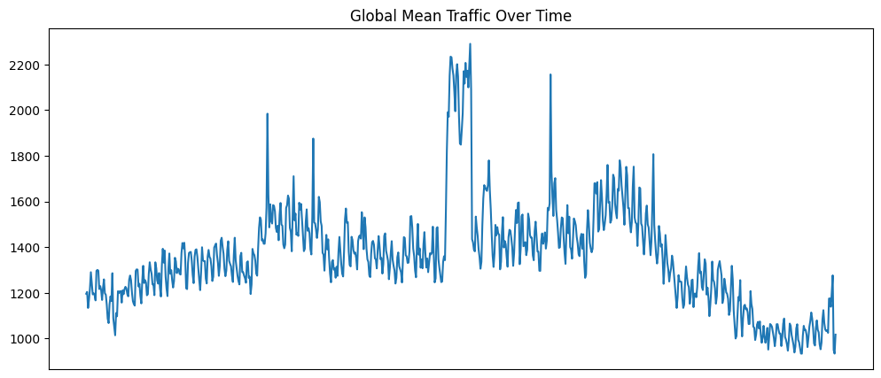
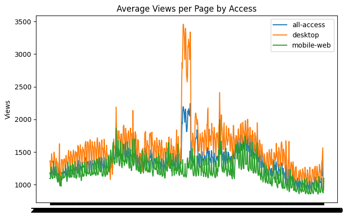
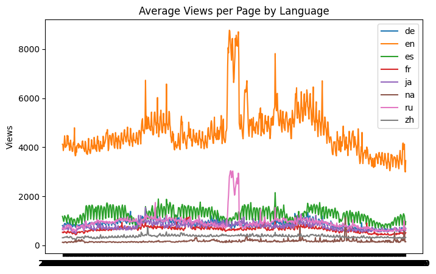
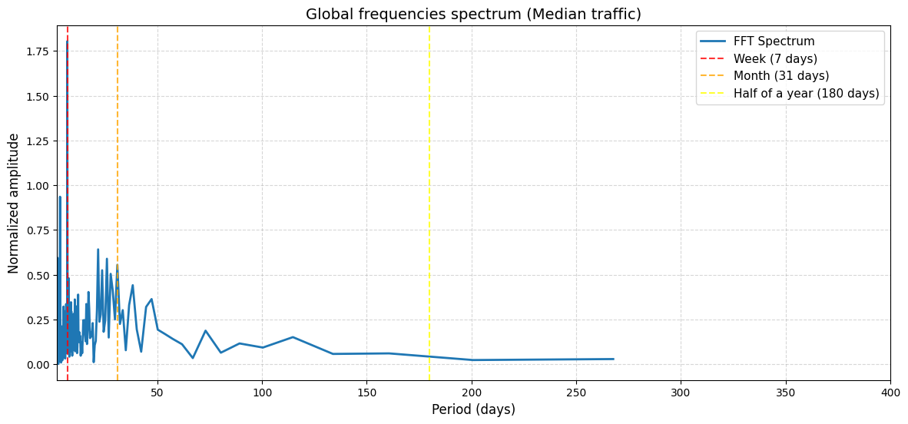
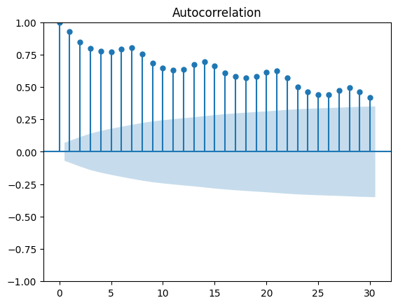
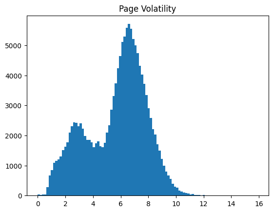
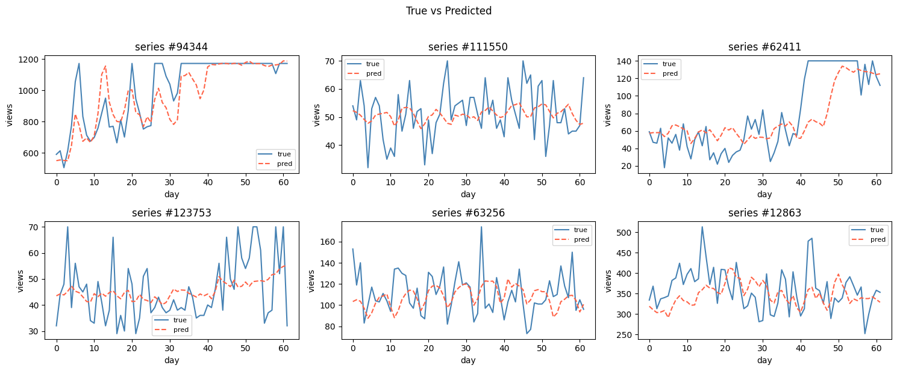

# Web Traffic Time Series Forecasting

My work for the [Kaggle Web Traffic Time Series Forecasting](https://www.kaggle.com/competitions/web-traffic-time-series-forecasting/overview) competition. The task: predict daily Wikipedia page views for ~145,000 articles 62 days into the future.

---

## Project Structure

```
WTTSF-competition/
├── configs/                  # YAML experiment configs
├── data/
│   └── processed/            # Preprocessed .npy / .npz files
├── dataset/
│   ├── dataset.py            # WTTSF_Dataset (PyTorch)
│   └── dataset_factory.py
├── losses/                   # MAE, SMAPE, Huber
├── models/
│   ├── attention/            # Additive, Dot, MultiHead, ConvAttention
│   ├── lstm_baseline.py      # Seq2seq LSTM with optional attention
│   └── lstm_conv_attn.py     # LSTM + ConvAttention
├── optimizers/
├── schedulers/
├── utils/
│   ├── config_cls.py         # Config dataclass
│   ├── constants.py          # Feature dims, lag days, regex
│   └── helpers.py
├── prepare_data.py           # Full preprocessing pipeline
├── train.py                  # Training loop
├── make_prediction.py
└── plots/                    # EDA images
```

---

## Data & EDA

The dataset contains daily page view counts for ~145k Wikipedia articles from **2015-07-01** to **2016-12-31**. Each page name encodes language, access type (desktop / mobile-web / all-access), and agent (spider / all-agents).

**Key findings from EDA:**

**Distribution.** Raw view counts are extremely right-skewed (log scale histogram goes from 10⁸ to 10⁰). After `log1p` transform the distribution becomes approximately normal — justifying the log-space modeling approach.



**Global traffic trend.** Mean traffic peaks mid-dataset, drops sharply at the end — the model needs to handle non-stationarity.



**By access type.** Desktop traffic dominates; mobile and all-access track closely.



**By language.** English pages receive 4–8× more traffic than all other languages combined.



**Seasonality (FFT).** The dominant period is ~7 days (weekly cycle), with a secondary signal around 30 days.



**Autocorrelation.** Strong short-term autocorrelation (slow decay over 30 lags), which confirms that AR-style models are appropriate. Year-over-year and quarter-over-quarter correlations are encoded as per-page scalar features.



**Page volatility.** Bimodal distribution — a quiet cluster (low-traffic bot/spider pages) and a noisier cluster of real human-visited pages.



---

## Preprocessing (`prepare_data.py`)

1. **Dead page removal** — drops pages with no traffic ever, or no traffic in the last 180 days.
2. **Winsorization** — per-series spike capping: values above `median + k * MAD` are clipped (`k=4` by default).
3. **Gap interpolation** — linear interpolation for NaN runs ≤ 7 days; longer gaps filled with 0.
4. **`log1p` transform** — stabilises variance and normalises the distribution.
5. **Lag indexes** — precomputed source-day indexes for lags `[7, 31, 180, 365]`.
6. **Temporal features** — sin/cos encodings of day-of-week and month (4 features total).
7. **Page metadata** — year & quarter autocorrelations, mean/std/CV, one-hot categoricals (lang, access, agent, site) — all normalised to zero mean, unit variance.

Outputs saved to `data/processed/`: `hits.npy`, `nan_mask.npy`, `lagged_ix.npy`, `lag_valid.npy`, `temporal.npy`, `page_meta.npz`, `meta.json`.

---

## Features

Each timestep in the encoder carries:

| Group | Features | Dim |
|---|---|---|
| Hits (log1p, z-scored) | current page views | 1 |
| Lagged hits | t−7, t−31, t−180, t−365 | 4 |
| Lag validity mask | whether lag is in range | 4 |
| Temporal | sin/cos DOW + sin/cos month | 4 |
| Page scalars | year AC, quarter AC, mean, std, CV | 5 |
| Page categoricals | lang (8) + access (4) + agent (2) + site (3) | 17 |
| **Total ENC_DIM** | | **35** |

The decoder receives the same features minus current hits (DEC_DIM = 34).

All page-level features are tiled across the time axis. Per-series z-score normalisation is applied at sample time inside the Dataset.

---

## Architecture

### Baseline LSTM (`lstm_baseline.py`)

Standard seq2seq with optional attention:

```
Encoder: LSTM (enc_h_size, n_layers)
    ↓ last hidden state + mean pooling → context
Decoder: stacked LSTMCells, autoregressive (prev prediction fed back)
    ↑ optional attention (additive | dot | multihead) over encoder states
Output: Linear → scalar prediction per step
```

Available attention types (all in `models/attention/attentions.py`):

- **Additive** (Bahdanau-style) — `W_q(query) + W_k(keys)` → tanh → scalar score
- **Dot** (scaled dot-product) — projected Q·K / √d
- **MultiHead** — wraps `nn.MultiheadAttention`, projects back to key size

### ConvAttn LSTM (`lstm_conv_attn.py`)

Replaces classical attention with `ConvAttention` (inspired by Arturus):

```
ConvFingerprint (CNN): enc_input[:, :, :2] → fingerprint vector
    3× [Conv1d → ReLU → MaxPool]  +  2× Linear

ConvAttention:
    fingerprint → focus scores [B, attn_window, n_heads]   (softmax)
    enc_states  → readout [B, readout_size, lookback]
    depthwise conv1d per head: sliding readout × focus weights → [B, readout_size, horizon]
    concat heads → [B, horizon, readout_size * n_heads]
```

The attention is computed **once** before the decoder loop (not re-queried each step), which makes it much faster on long sequences. The encoder final states are projected into decoder initial states via learned linear layers.

---

## Training

**Loop** (`train.py`): standard PyTorch with tqdm, gradient clipping, EMA weights, early stopping, and checkpoint saving on validation improvement.

**Data split strategy:**

The pipeline supports two modes depending on whether validation is used (controlled via the `--use-valid` flag):

* **Final Training Mode (No Validation):** Used for production runs to train the final model with maximum data before making competition predictions.
  * **`train`** — Random window start that can use the entire available time range up to the last available day (`back_offset=0`). This maximizes data augmentation via random offsets.
  * **`valid`** — Disabled (`None`).
* **Experimentation Mode (With Validation):** Used exclusively for hyperparameter tuning and model architecture evaluation.
  * **`train`** — Random window start, but constrained to leave a `back_offset` (equal to the forecasting `horizon`) at the very end of the time series to prevent data leakage into the validation set.
  * **`valid`** — A single fixed window at the very end of the dataset: `n_days - lookback - horizon - back_offset`.

**EMA**: `torch_ema.ExponentialMovingAverage` with `decay=0.999` — averaged weights used at inference and checkpoint saving.

---

## Experiments

### Loss functions

| Loss | Notes |
|---|---|
| **Smoothed SMAPE** | Competition metric; most stable gradients. `0.5 + ε=0.1` avoids division-by-zero. |
| **MAE** | Simple, slightly better final results than SMAPE in practice. |
| **Huber** | Smaller `delta` → closer to MAE → better results. |

### Model comparison

| Model | Notes |
|---|---|
| Baseline (no attn) | Solid baseline |
| + Additive attn | Similar to baseline, marginally better |
| + Dot attn | Slightly worse than additive |
| + MultiHead attn | More expensive, similar to additive |
| **ConvAttn** | Slightly better and faster than classical attention |

### Epochs

~20 epochs was optimal across all experiments.

---

## Predictions



The model captures the general level and slow trends well. High-frequency spikes remain difficult to predict — consistent with the noisy autocorrelation structure of the data (lag-7 ACF is broadly distributed, not a sharp peak).

---

## Key Takeaways

- **log1p normalisation** is essential; raw counts are too skewed.
- **Lagged features** (7 / 31 / 180 / 365 days) are the single most impactful feature group — they explicitly give the model access to seasonal information without requiring perfect LSTM long-range memory.
- **ConvAttention** is a good alternative to standard attention for long sequences: computed once, not per-step.
- **MAE/smoothed SMAPE loss** both are good for this data.
- **EMA + multi-checkpoint ensembling** reduces variance significantly on noisy data.
- Resutls are decent but not competitive — further gains would likely come from better data preprocessing, smarter architectures, larger ensembles, better hyperparameter search, and test-time augmentation.

---

## References

- [Arturus — 1st place solution](https://github.com/Arturus/kaggle-web-traffic) — architecture inspiration, especially ConvAttention and lagged features
- [Competition overview](https://www.kaggle.com/competitions/web-traffic-time-series-forecasting/overview)
- Bahdanau et al. — *Neural Machine Translation by Jointly Learning to Align and Translate*